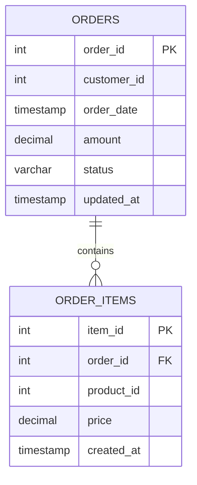

# Self-Healing ETL Pipeline with a Maintenance Copilot

An incremental-load pipeline into Apache Iceberg that deliberately accumulates the "small-file problem," paired with an AI copilot that can observe table health and perform controlled, human-confirmed maintenance.

---

## Table of Contents

- [Overview](#overview)
- [Features](#features)
- [Architecture](#architecture)
- [Data Model](#data-model)
- [Tech Stack](#tech-stack)
- [Prerequisites](#prerequisites)
- [Installation](#installation)
- [Configuration](#configuration)
- [Running the Project](#running-the-project)
- [Usage](#usage)
- [Project Structure](#project-structure)
- [MCP Tools Reference](#mcp-tools-reference)
- [API Endpoints](#api-endpoints)
- [Resetting Project State](#resetting-project-state)
- [Known Limitations](#known-limitations)
- [Stretch Goals Status](#stretch-goals-status)
- [Key Forensic Findings](#key-forensic-findings)
- [Challenges Attempted](#challenges-attempted-and-what-was-learned)
- [Self-Reflection](#self-reflection)

---

## Overview

This project is a self-healing ETL pipeline built on Apache Iceberg, paired with an AI maintenance copilot. It's composed of two parts working together:

- A data engineering pipeline that performs genuine incremental (watermark-based CDC) loads from a Postgres OLTP source into two Iceberg fact tables, then deliberately runs 50+ small append/update batches to reproduce the "small-file problem" that real merge-on-read lakehouses accumulate over time.
- An AI agent layer (FastAPI + an MCP tool server) that can observe real, computed table-health metrics, proactively flag degradation, and perform destructive maintenance (compaction, delete-file resolution, manifest rewriting, snapshot expiry) — but only after a human explicitly confirms the action.

**Business scenario:** an e-commerce platform's checkout service continuously writes to orders and order_items in Postgres. Those tables are mirrored into an Iceberg lakehouse for analytics — but no one owns lakehouse maintenance day-to-day. Over weeks, small incremental writes fragment the tables under merge-on-read: file counts climb, BI dashboards querying these tables get progressively slower, and by the time anyone notices, the cause isn't obvious from the outside. This project puts an engineer in that seat: reproduce the failure mode honestly, measure it with real numbers, and give an AI copilot the ability to both catch it early and fix it — without ever being allowed to act destructively on its own judgment.

In short:

1. A genuine incremental (merge/upsert) load pipeline from a Postgres OLTP source into two Iceberg fact tables.
2. Fifty-plus small append/update batches that intentionally fragment the tables under merge-on-read.
3. Real, measured health metrics — before and after maintenance — computed from Iceberg's own metadata tables, never invented.
4. An AI agent that can observe that state and take a destructive maintenance action only after explicit human confirmation.

---

## Features

- **Watermark-based CDC pipeline** — reads only what changed in Postgres since the last checkpoint, not a full reload every run.
- **Realistic OLTP data** — customer and product popularity follow capped, tiered skew (not uniform randomness); catalog prices are fixed per product with discrete sale tiers; order statuses include cancellations, returns, payment failures, and stuck orders.
- **Live health scoring** — a single, shared formula (fragmentation + delete-bloat weighted) used identically by the chat agent and the dashboard trend chart.
- **Human-in-the-loop maintenance** — the agent can only *propose* maintenance; execution requires an explicit confirmation step, enforced both in the UI and the backend.
- **Proactive monitoring** — a scheduled job checks table health every minute and proactively alerts in chat if a table crosses a fixed threshold, without waiting to be asked.
- **OCC conflict simulation (stretch)** — two concurrent Spark writers touch the same partition; the resulting Iceberg commit rejection is logged with real timestamps and explained by the agent in plain language on request.

---

## Architecture

Two independent backend processes, one frontend, connected through an MCP tool server:


**Note:** the dashboard connects to the MCP tool server directly (via `@modelcontextprotocol/sdk`'s JS client), separately from the chat panel's path through the FastAPI backend. Both reach the same tool server.

---

## Data Model

Two fact tables, mirrored 1:1 from Postgres into Iceberg. No separate physical dimension tables — `customer_id` and `product_id` are foreign-key-style references into logical dimensions generated by `catalog.py` (fixed catalog pricing, tiered popularity), not their own tables.

**Fact: `orders`**
| Column | Type | Notes |
|---|---|---|
| `order_id` | INT (PK) | |
| `customer_id` | INT | references the logical customer dimension in `catalog.py` |
| `order_date` | TIMESTAMP | |
| `amount` | DECIMAL(10,2) | sum of this order's `order_items.price` |
| `status` | VARCHAR(20) | Pending / Shipped / Completed / Cancelled / Returned / Payment Failed |
| `updated_at` | TIMESTAMP | added post-seed; drives the CDC watermark filter |

**Fact: `order_items`**
| Column | Type | Notes |
|---|---|---|
| `item_id` | SERIAL (PK) | |
| `order_id` | INT (FK → orders.order_id) | |
| `product_id` | INT | references the logical product dimension in `catalog.py` |
| `price` | DECIMAL(10,2) | catalog base price, or one of a small set of fixed sale-tier prices |
| `created_at` | TIMESTAMP | added post-seed; drives the CDC watermark filter |

**Relationship:** `orders` 1 → many `order_items`.



---

## Iceberg Concepts in This Project

Since the core of this project is really about understanding how Iceberg's table format works internally — not just calling its SQL procedures — here's what each piece of metadata actually is, and where it shows up concretely in this codebase.


- **Metadata File** — a single JSON file (e.g. v3.metadata.json) representing the table's complete state at a point in time: its schema, partition spec, current snapshot ID, and the full list of all snapshots the table has ever had. A new one is written on every commit (writeTo(...), every MERGE INTO, every maintenance call). Found on disk under warehouse/db/orders/metadata/.
- **Snapshot** — one committed version of the table, identified by a snapshot_id. Every MERGE INTO in pipeline.py, and every one of the four procedures called in execute_table_maintenance(), creates exactly one new snapshot — regardless of how many rows or files that operation touched. Queried in this project via SELECT * FROM local.db.orders.snapshots (used in get_table_metrics() and get_deep_telemetry).
- **Manifest List** — the file a snapshot points to; it's a list of all the Manifest Files that make up that snapshot's view of the table, along with summary stats per manifest (e.g. how many data/delete files it covers).
- **Manifest File** — one entry in the manifest list; it's the file that actually records each individual data file or delete file's path, partition values, and column-level stats. This is what local.db.orders.manifests and local.db.orders.files are querying under the hood. rewrite_manifests (step 3 of execute_table_maintenance()) consolidates many small manifest files into fewer, larger ones — separate from compacting the data files themselves.
- **Delete Files** — under merge-on-read (the mode both tables use here), an UPDATE inside a MERGE INTO doesn't rewrite the existing data file — it writes a small new data file for the changed row(s) and a small delete file marking the old row version as superseded. This is the direct mechanical cause of the fragmentation this project deliberately reproduces over 50 batches, and exactly what rewrite_position_delete_files (step 2 of maintenance) resolves.

---

## Tech Stack

| Layer | Technology |
|---|---|
| Table format | Apache Iceberg (Hadoop catalog, local warehouse), format-version 2, merge-on-read |
| Compute engine | Apache Spark (PySpark) |
| OLTP source | PostgreSQL |
| Backend (chat/agent) | FastAPI + Groq (Llama 3.3 70B) |
| Backend (tools) | FastMCP (Model Context Protocol server) |
| Scheduling | APScheduler (proactive health checks) |
| Postgres driver (mutation) | psycopg2 |
| Postgres driver (Spark reads) | JDBC (`org.postgresql:postgresql:42.7.3`) |
| Frontend | React + TypeScript, Tailwind CSS |
| Charting | Recharts |
| MCP client (Python) | `mcp.client.sse` / `mcp.client.session` |
| MCP client (JS) | `@modelcontextprotocol/sdk` (SSE transport) |
| Markdown rendering | react-markdown |

---

## Prerequisites

- Python 3.10+
- Node.js 18+ and npm
- A running PostgreSQL instance
- A Groq API key ([console.groq.com](https://console.groq.com))
- Java 8/11/17 (required by PySpark)

---

## Installation

```bash
# 1. Clone and enter the project
git clone <your-repo-url>
cd project2-self-healing-etl

# 2. Python dependencies (ideally inside a virtual environment)
pip install -r requirements.txt

# 3. Frontend dependencies
cd frontend
npm install
cd ..
```

---

## Configuration

Create a `.env` file in the project root:

```env
DATABASE_URL=postgresql://<user>:<password>@<host>:<port>/<dbname>
GROQ_API_KEY=<your-groq-api-key>
```

---

## Running the Project

Run these in order, each in its own terminal:

```bash
# 1. Seed the OLTP source (drops/recreates orders, order_items; loads 10,000 baseline orders)
python data_generate.py seed

# 2. One-time schema setup (adds updated_at/created_at columns, creates pipeline_watermark)
python run_ddl_setup.py

# 3. Start the FastMCP tool server (port 8000)
python -m src.app.main

# 4. Start the FastAPI chat backend (port 8001)
python main.py

# 5. Start the frontend
cd frontend
npm run dev
```

Open the frontend URL printed by Vite/npm (typically `http://localhost:5173`).

---

## Usage

1. From the **Dashboard** tab, click **Trigger 50-Batch Load** to run the incremental pipeline and intentionally degrade a table.
2. Watch the trend chart — file count should climb faster than snapshot count as merge-on-read accumulates small data and delete files.
3. Switch to the **AI Copilot** tab and ask:
   - *"Is the orders table healthy?"* — the agent reports real, current metrics.
   - *"Clean it up."* — the agent proposes maintenance; a confirmation card appears with **Execute Compaction** / **Dismiss**.
4. Click **Execute Compaction** — this is the only path that actually runs the destructive maintenance procedure. Post-maintenance health is reported using real numbers, not a generated summary.
5. (Stretch) Go to the **OCC Simulation** tab, click **Trigger Data Collision**, then ask the copilot *"What is the OCC conflict that occurred?"* for a plain-language, log-grounded explanation.
6. Ask *"What's happened since I last checked?"* — the agent summarizes all activity (batches, maintenance, health) since your previous check-in, and resets the checkpoint.

---

## Project Structure

```
project2-self-healing-etl/
├── data_generate.py            # Postgres seeding + incremental OLTP simulation
├── main.py                     # FastAPI chat backend (port 8001)
├── mcp_client.py                # Python MCP client bridge (FastAPI -> MCP tool server)
├── run_ddl_setup.py             # One-time Postgres schema setup
├── reset_watermark.py           # Truncates pipeline_watermark for a clean reset
├── requirements.txt
├── frontend/
│   └── src/
│       ├── App.tsx
│       └── components/
│           ├── AICopilot.tsx
│           ├── Dashboard.tsx
│           ├── OCCDiagram.tsx
│           └── OCCVisualizer.tsx
├── logs/
│   ├── occ_error.log
│   └── simulation_history.log
│   
├── src/
│   ├── app/
│   │   ├── main.py              # MCP tool server entrypoint (port 8000)
│   │   └── tools.py              # MCP tool definitions
│   ├── ingestion/
│   │   └── pipeline.py           # Watermark-based CDC load + degrade simulation
│   ├── maintenance/
│   │   └── maintenance.py        # Iceberg compaction/expiry procedures
│   ├── monitoring/
│   │   ├── metrics.py            # Live health scoring
│   │   ├── history_logger.py     # Persistent JSONL trend history
│   │   └── spark_session.py      # Shared SparkSession singleton
│   │
│   └── utils/
│       └── catalog.py            # Realistic fake-data generation logic
├── tests/
│   ├── test_iceberg_concurrency.py  # OCC simulation script
│   └── verify_data.py               # Manual ad-hoc query script
└── warehouse/                    # Iceberg data + JSONL health history (git-ignored)
```

---

## MCP Tools Reference

| Tool | Purpose |
|---|---|
| `get_table_health` | Live health metrics for one or more tables |
| `propose_maintenance` | Step 1 of the human-in-the-loop flow — announces intent only, no side effects |
| `execute_confirmed_maintenance` | Step 2 — runs the actual destructive maintenance, only reachable after confirmation |
| `run_incremental_load` | Triggers the 50-batch pipeline as a background task; rejects overlapping runs |
| `get_pipeline_status` | Polled by the dashboard to detect real completion of a triggered load |
| `get_table_history` | Returns the full persisted JSONL history for the trend chart |
| `get_deep_telemetry` | Raw snapshot/manifest/file listings for detailed inspection |

---

## API Endpoints

| Endpoint | Method | Server | Purpose |
|---|---|---|---|
| `/chat` | POST | FastAPI (:8001) | Main copilot endpoint |
| `/api/agent-notifications` | GET (SSE) | FastAPI (:8001) | Streams proactive health alerts |
| `/api/simulate-occ` | GET (SSE) | FastAPI (:8001) | Runs and streams the OCC concurrency simulation |
| `/sse` | GET (SSE) | MCP server (:8000) | MCP tool-call transport |

---

## Resetting Project State

Run this whenever the underlying data-generation logic changes, or state becomes inconsistent:

```bash
# Windows PowerShell
Remove-Item -Recurse -Force warehouse
python data_generate.py seed
python run_ddl_setup.py
python reset_watermark.py

# macOS/Linux
rm -rf warehouse/
python data_generate.py seed
python run_ddl_setup.py
python reset_watermark.py
```

This clears the Iceberg warehouse (tables, snapshots, health history logs), re-seeds Postgres with fresh baseline data, restores the CDC-required columns and watermark table, and clears any stale watermark rows.

---

## Known Limitations

- `_pipeline_status` and `maintenance_in_progress` are in-memory flags local to the FastAPI process — not persisted, not shared across multiple backend instances.
- The dashboard connects to the MCP tool server directly, bypassing the FastAPI backend, while the chat panel goes through FastAPI — two independent client paths to the same server.
- The health-alert threshold (70%) is a fixed constant, not derived from a formal SLA.
- No automated test suite; `tests/` contains manual verification scripts, not pytest tests.

---

## Stretch Goals Status

- ✅ **OCC conflict simulation** — implemented, isolated to its own `db.occ_test` table, explained in chat via real logged timestamps.
- ✅ **Proactive scheduled health checks** — implemented via APScheduler, alerts pushed over SSE without a user prompt.

---

## Key Forensic Findings

> **TODO — replace this section with your own captured evidence, not descriptions.** Paste actual command output / screenshots for each item below.

- **Data realism verification** — SQL query output showing the fix for power-buyer skew, bestseller skew, and catalog price consistency (before: top customer at 38% of all orders; after: capped tiered distribution). *[paste query + output/screenshot]*
- **Before/after health metrics from a real maintenance run** — output of `get_table_health` immediately before clicking Execute Compaction, and immediately after. *[paste both outputs]*
- **Manifest/snapshot inspection** — output of a query like `SELECT * FROM local.db.orders.manifests` and `SELECT * FROM local.db.orders.snapshots`, run yourself against a live table. *[paste output]*
- **OCC conflict raw evidence** — the actual Java stack trace from `logs/occ_error.log` showing the `ValidationException` Iceberg raised. *[already captured — paste it in]*
- **A real bug found and fixed during development** — e.g. the `RecursionError` traceback from a self-referential `calculate_health_score()` call, and the one-line diagnosis. *[paste traceback + fix]*

---

## Challenges Attempted (and what was learned)

> **TODO — verify this list matches your actual experience before submitting; edit freely.**

- **Data realism was harder than "add randomness."** Naive `random.randint`/`random.uniform` calls produced uniform distributions that looked nothing like real customer/product/price behavior. Fixing this required understanding *why* — e.g. an uncapped Zipf-style power-law formula mathematically guarantees the top-ranked id captures ~30-38% of all mass regardless of population size, which isn't a "more randomness" problem, it's a formula problem. Learned to verify generated data with real SQL distribution checks rather than trusting that "it looks skewed" is the same as "it's realistic."
- **Two independently-computed health scores silently disagreed.** `metrics.py` (live chat tool) and `history_logger.py` (trend chart) each had their own scoring formula, computed differently, so the same table at the same moment could report two different health percentages. Learned that when the same real-world quantity is computed in two places, it needs one canonical implementation reused by both — otherwise, they *will* eventually drift apart silently.
- **An LLM-judged proactive alert produced false positives.** The health-audit scheduler asked an LLM to decide "is this healthy?" from free text and gated the alert on whether the reply contained the literal word "HEALTHY" — which fires incorrectly whenever the LLM phrases a healthy result differently, or editorializes about numbers that are actually fine. Learned that any already-computed deterministic value (like a numeric health score) should gate control flow directly — the LLM should only be used to *phrase* an outcome, never to *decide* one, when a real number is already available.
- **A recursion bug from a copy-paste error, not a logic bug.** A refactor meant to centralize health-score math into one function accidentally left the function calling itself with its own parameters — producing a `RecursionError` that initially looked like a Spark/py4j metadata-depth issue. Learned to read the actual traceback before assuming the "obvious" complex explanation; the real cause was a one-line mistake, not a deep systems issue.

---

## Self-Reflection

> **TODO — these require your own investigation and honest answers. Do not submit AI-generated answers to these questions; the grading explicitly checks for real depth, not plausible-sounding text.** For each question below, the evidence you need to gather is listed — go run the described command/inspection yourself, then write the answer from what you actually observe.

### 4.1 Data & Iceberg Understanding

**What specifically did the Metadata File, Manifest List, and Manifest File each contain in your project — and how did you verify it yourself, rather than just citing the docs?**
*Evidence to gather:* run `spark.sql("SELECT * FROM local.db.orders.snapshots").show(truncate=False)` and `spark.sql("SELECT * FROM local.db.orders.manifests").show(truncate=False)` against a live table; also locate the actual JSON metadata file on disk under `warehouse/db/orders/metadata/` and open it directly.
*Your answer:* _(fill in after inspecting real output)_

**Where exactly did partition pruning save work in your queries? What evidence did you actually look at to know that?**
*Note:* your tables are not currently partitioned (no `PARTITIONED BY` clause in `pipeline.py`'s `writeTo(...)` calls) — if that's accurate, the honest answer may be "partition pruning wasn't applicable in this project's table design," which is a valid and honest self-reflection answer. Verify this by checking your actual `writeTo()` calls before answering either way.
*Your answer:* _(fill in after checking)_

**What would go wrong if you handled a schema change by renaming a column instead of evolving it? Why does Iceberg's Field ID approach avoid that pitfall?**
*Evidence to gather:* if you have time, actually try `ALTER TABLE ... RENAME COLUMN` on a test table via Spark SQL and observe what Iceberg does with the underlying Field ID versus what a naive Parquet-only system would do.
*Your answer:* _(fill in)_

### 4.2 AI Agent & Engineering Understanding

**Which parts of your MCP tool's output does the agent actually rely on to ground its answer — and what happens if that tool returns bad or stale data?**
*Evidence to gather:* trace exactly which fields of `get_table_health`'s return string the LLM's response quotes back verbatim vs. paraphrases; consider what happens if `get_table_metrics()` throws (it currently returns an error string, not an exception — check how that string flows into the chat reply).
*Your answer:* _(fill in)_

**Where did you have to override, correct, or sanity-check something your AI coding assistant generated?**
*This one you can answer directly and honestly from this project's actual history* — e.g. the LLM-keyword-matching alert bug, the two disagreeing health formulas, the recursion bug from a bad refactor, the false assumption about `psql` availability on Windows. Pick the ones that are true for you.
*Your answer:* _(fill in)_

**If a stakeholder asked "can I trust this number?", what in your system would you point to in order to answer them?**
*Your answer:* _(fill in — likely candidates: the health score is computed live from Iceberg's own metadata tables via a single shared formula, not invented by the LLM; the maintenance result reports real post-action metrics, not a generated summary)_

### 4.3 Business Understanding

**Who would actually use this in your scenario, and what decision would they make differently because of it?**
*Your answer:* _(fill in — e.g. a data platform engineer deciding when to schedule compaction, rather than discovering degradation only after a BI dashboard complaint)_

**What's the biggest risk if this pipeline silently broke for a week — and would your system have caught that, or missed it?**
*Consider honestly:* the proactive health-audit scheduler checks *fragmentation*, not *whether new data is arriving at all* — if the pipeline itself stopped running (not just degraded), would `run_health_audit()` actually detect that, or would a completely stale, unchanging-but-still-"healthy"-looking table go unnoticed? This is worth checking against your actual code before answering.
*Your answer:* _(fill in)_